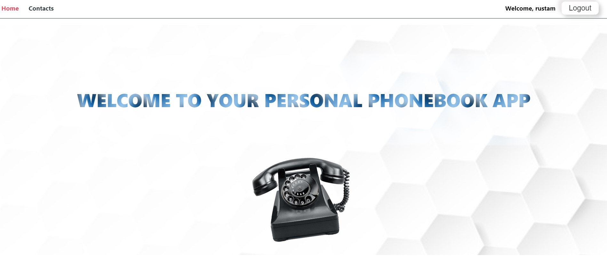

# Phonebook Application

This is a phonebook application built with React, HTML, CSS, JS, and Redux. It allows users to store and manage their contacts online.

## Table of Contents

Installation

Usage

Contributing

### Installation

To install the application, follow these steps:

Clone the repository to your local machine.
Open a terminal and navigate to the root directory of the project.
Run npm install to install the dependencies.
Run npm start to start the development server.
Open http://localhost:3000 in your browser.

### Usage

To use the application, follow these steps:

Register or Login to your personal app account.
Enter the contact's name and phone number in the input fields.
Click on the "Add Contact" button to add a new contact.
To edit or delete a contact, click on the "delete" or "update" button in the list

### Contributing

Contributions to this project are welcome. To contribute, follow these steps:

Fork the repository to your own GitHub account.
Create a new branch from the main branch.
Make your changes and commit them with descriptive commit messages.
Push your changes to your forked repository.
Create a pull request to merge your changes into the main branch of this repository.
